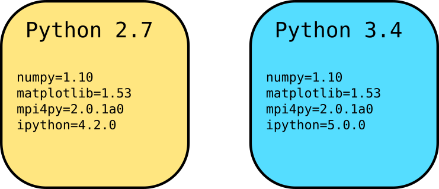

<!-- START doctoc generated TOC please keep comment here to allow auto update -->
<!-- DON'T EDIT THIS SECTION, INSTEAD RE-RUN doctoc TO UPDATE -->


- [Managing Python Installations on the Palmetto Cluster](#managing-python-installations-on-the-palmetto-cluster)
  - [Python versions available on Palmetto Cluster](#python-versions-available-on-palmetto-cluster)
    - [The default (system) Python](#the-default-system-python)
    - [Python modules](#python-modules)
    - [Anaconda modules](#anaconda-modules)
  - [Installing Python packages](#installing-python-packages)
    - [Using pip to install packages and dependencies](#using-pip-to-install-packages-and-dependencies)
    - [Building the package yourself](#building-the-package-yourself)
  - [Using `conda` to manage Python environments](#using-conda-to-manage-python-environments)
    - [Creating an environment](#creating-an-environment)
    - [Installing packages in an environment](#installing-packages-in-an-environment)
    - [Cloning an existing environment](#cloning-an-existing-environment)

<!-- END doctoc generated TOC please keep comment here to allow auto update -->

# Managing Python Installations on the Palmetto Cluster

This article is for anyone using Python and Python packages
on the Palmetto cluster.
It aims to explain the different options
for installing Python and Python packages on the cluster.

As an example,
consider the scenario of a user working on two Python projects,
each project has different requirements:



The first project requires
Python 2.7 and a set of Python packages such as `numpy`.
The second package requires Python 3.4,
and a different set of Python packages.

This article will explain how users
can correctly set up Python and the required Packages
for such projects.
In particular, this article will cover:

* All the available versions of Python on the cluster
* The different ways for users to install Python packages
* How to use the `conda` package manager to
install and maintain packages separately for each project.

## Python versions available on Palmetto Cluster

One of the first points of confusion
for many users may be about
the different versions of Python available on the Palmetto cluster.
Currently,
the versions of Python used by the community
are either **2.X.Y** (for example, 2.7.6)
or **3.X.Y** (for example, 3.5.2).
The Palmetto cluster makes many versions of Python available,
and we will begin by enumerating them:

### The default (system) Python

The "default" version of Python on the Palmetto cluster
(also known as the *system* Python),
is **2.6.6**. This is the version of Python that
ships with the operating system running on Palmetto
(currently Scientific Linux release 6.7).

```shell
$ module list
No Modulefiles Currently Loaded.

$ which python
/usr/bin/python

$ python --version
Python 2.6.6
```

In general,
it is highly recommended that users
**not** rely on this version of Python to
run their own applications:

1. Libraries that they use may require other versions
of Python (generally, 2.7 or higher).

2. The system version of Python may change.
Any applications or packages that users
may build using the system Python
will likely not run if this happens.

### Python modules

In addition to the default system Python,
the Palmetto cluster enables users to
load different versions of Python as modules:

```shell
$ module avail python

------------------------- /software/modulefiles -------------------------
python/2.7.6 python/3.3.3 python/3.4
```

Any of these modules can be loaded
to use a different version of Python than 2.6.6:

```shell
$ module add python/3.4

$ python --version
Python 3.4.2

$ which python
/software/python/3.4/bin/python
```

### Anaconda modules

There are also several "Anaconda" modules available on the cluster.

```shell
$ module avail anaconda
anaconda/1.9.1  anaconda/2.3.0  anaconda/2.4.0  anaconda/2.5.0  anaconda/4.0.0  anaconda3/2.5.0 anaconda3/4.0.0

$ module add anaconda3/2.5.0

$ python --version
Python 3.5.2 :: Anaconda 2.5.0 (64-bit)

$ which python
/software/anaconda3/2.5.0/bin/python
```

The `anaconda3` modules contain Python 3,
while the `anaconda` modules contain Python 2.
[Anaconda][anaconda-overview] is a Python "distribution",
which bundles together several packages
that are used in scientific computing and data analysis,
including `numpy`, `scipy`, `matplotlib`, `pandas`, and
several hundreds of others.
Using the Anaconda distribution removes the burden
of manually installing these packages from source.
Once the Anaconda module is loaded,
importing these packages "just works":

```shell
$ module add anaconda3/2.5.0
$ python
Python 3.5.2 |Anaconda 2.5.0 (64-bit)| (default, Jul  2 2016, 17:53:06)
[GCC 4.4.7 20120313 (Red Hat 4.4.7-1)] on linux
Type "help", "copyright", "credits" or "license" for more information.
>>> import tables       # imports the PyTables package
>>> tables.__file__     # prints where the tables module is loaded from
'/software/anaconda3/2.5.0/lib/python3.5/site-packages/tables/__init__.py'
```
Importantly, Anaconda provides the `conda` package manager,
which will be discussed later in this article.

### Which Python should I use?

In general,
the Python versions provided by the `anaconda` modules
may be a good starting point for most users,
as they also provide several widely-used packages.
However, if you want to build and maintain your own versions
of Python packages,
you may want to use the `python` modules.

Later in this article,
we will also see another option:
using `conda` to easily install *any* version of Python,
and easily install packages for this version.

## Installing Python packages

Although the `anaconda` modules already provide several of the
widely used packages,
you may need to install other packages or different versions
of the available packages for your own project.
This can sometimes be a challenge,
because some packages may require other packages (i.e., they have dependencies),
and because users do not have root (administrative) privileges on the cluster.
Most packages and their dependencies can be installed in one of the following ways:

1. Using `pip`
2. Downloading and building the package and its dependencies yourself
3. Using the `conda`

Several packages will provide the option
to install in more than one way.
For example, see the [installation instructions
for the `mpi4py` package][mpi4py-install],
which can be installed either using `pip`,
or by downloading and building from source.

It is not necessary that you install *all* packages
using `pip`,
or build *all* packages yourself.
Your setup can contain several packages,
and each one may be installed in any of the above ways.

### Using pip to install packages and dependencies

`pip` is a program that installs Python packages,
and automatically installs any other Python packages
that are dependencies:

```shell
$ pip install package-name --user
```

The `--user` switch ensures that the package is installed
into your home directory, and not into the `/usr/local` directory.
This will only install the package
for the currently running version of Python.

Unfortunately,
`pip` is generally not well suited for installing scientific software packages
like `numpy` or `matplotlib` (see [here](https://packaging.python.org/science/) for explanation).

### Building the package yourself

When packages cannot be installed via `pip`
or when you want a package to be built in a specific way,
e.g., linked against specific libraries,
you may need to download and build the package for yourself.
The instructions for building a package are generally
a part of the package's documentation.
For example, see the instructions to manually install the `mpi4py` package
[here][mpi4py-install]. Importantly, notice the last step:

```shell
python setup.py install --user
```

The `--user` switch ensures that the package is installed
to your home directory, and not a directory like `/usr/local`.
Even when you manually build a package,
it is only compatible and available for the specific
version of Python loaded while building it.

When building packages yourself,
you will generally have to manage dependencies
yourself, i.e., they will not automatically be installed.

## The `conda` package manager

`conda` is a package manager similar to `pip`,
but with two major improvements over `pip`:

1. `conda` also installs non-Python packages and dependencies.
For example, the `numpy` package has dependencies such as `ATLAS`, `gfortran`, etc.,
and `pip` is not able to install these for you.
`conda` will automatically install such dependencies.

2. `conda` also lets users create and manage "environments".
A `conda` environment is a directory
containing a specific version of Python
and a collection of packages for this version of Python.

### Creating an environment

You can create a `conda` environment using the
`conda create` command, and specify
what version of Python to install in this environment:

```shell

```

### Installing packages in an environment

* Using conda install
* Using pip
* By building it

### Cloning an existing environment


[mpi4py-install]: https://mpi4py.scipy.org/docs/usrman/install.html
[python-packaging-science]: https://packaging.python.org/science/
[anaconda-overview]: https://www.continuum.io/anaconda-overview
